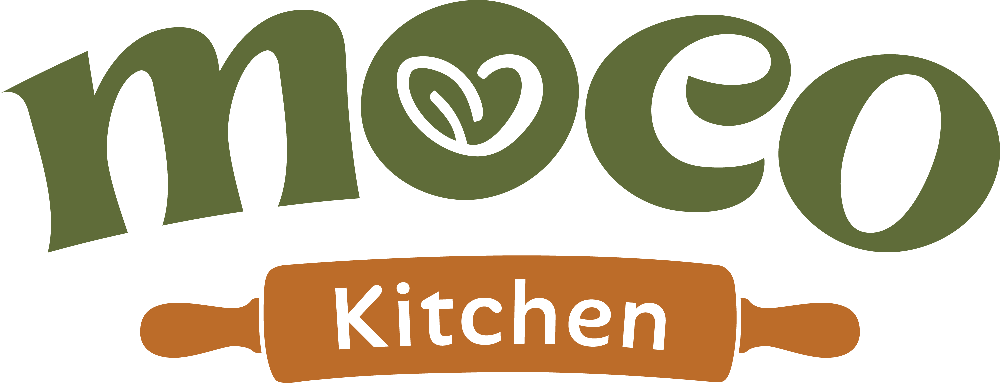

# Design — Nhận diện thương hiệu MOCO Kitchen

## 1. Vai trò của tài liệu

Tài liệu này mô tả hệ thống nhận diện của MOCO Kitchen: logo, màu sắc, chữ, hình ảnh và cách áp dụng lên website, mạng xã hội và tài liệu trình bày.

Khác với file thiết kế kỹ thuật của landing page, tài liệu này trả lời câu hỏi lớn hơn: **MOCO trông như thế nào, vì sao trông như vậy và cần giữ nhất quán ra sao ở mọi điểm chạm.**

## 2. Định vị thiết kế

MOCO Kitchen là một tiệm bánh healthy online tại Hà Nội, làm theo mẻ nhỏ và ưu tiên minh bạch thành phần. Thiết kế cần giữ được hai cảm giác cùng lúc:

- **Đáng tin:** thông tin rõ, không phóng đại sức khỏe, không làm bánh trông khác thực tế.
- **Có cảm xúc:** ấm, gần, thủ công, gợi cảm giác căn bếp nhỏ hơn là một thương hiệu công nghiệp.

Từ khóa nhận diện:

| Từ khóa | Ý nghĩa trong thiết kế |
|---|---|
| Thủ công | Đường nét mềm, hình ảnh thật, chất liệu gỗ/gốm/giấy nến |
| Lành mạnh | Xanh lá, nền sáng, bố cục thoáng, thông tin minh bạch |
| Ấm áp | Màu kem, nâu đất, ánh sáng tự nhiên và giọng nói gần gũi |
| Có trách nhiệm | Không dùng hình ảnh hoặc câu chữ gây hiểu nhầm về dinh dưỡng |

## 3. Logo

Logo MOCO Kitchen là một wordmark chữ thường, nét dày, bo cong và có nhịp điệu mềm. Tinh thần chính là thân thiện, dễ nhớ và có cảm giác thủ công.

### 3.1 Cấu trúc logo

| Thành phần | Vai trò |
|---|---|
| Chữ `moco` | Tên thương hiệu, dùng chữ thường để tạo cảm giác gần gũi |
| Biểu tượng trong chữ `o` | Kết hợp hình trái tim và chiếc lá, gợi tinh thần “tốt cho thân thể, dễ chịu cho cảm xúc” |
| Dải rolling pin | Nhắc trực tiếp tới căn bếp và việc làm bánh thủ công |
| Chữ `Kitchen` | Xác định lĩnh vực, giúp người mới hiểu ngay đây là thương hiệu đồ ăn/bánh |

### 3.2 Ý nghĩa biểu tượng

Logo không dùng hình bánh cụ thể vì MOCO có nhiều dòng sản phẩm. Thay vào đó, biểu tượng trái tim và chiếc lá đại diện cho hai lớp ý nghĩa:

- **Heart:** món ngọt vẫn cần đem lại niềm vui, không chỉ là một lựa chọn ăn kiêng.
- **Leaf:** nguyên liệu và cách truyền thông cần minh bạch, nhẹ nhàng, không hô hào.
- **Rolling pin:** mọi thứ bắt đầu từ căn bếp và bàn tay làm bánh.

### 3.3 Phiên bản sử dụng

| Phiên bản | Khi dùng |
|---|---|
| Logo đầy đủ xanh + rolling pin | Website, slide, cover, footer, tài liệu chính |
| Logo xanh một màu | Khi nền đã có nhiều chi tiết hoặc dùng trên bao bì nhỏ |
| Biểu tượng `o` trái tim/lá | Avatar, favicon, sticker, tem tròn hoặc watermark nhỏ |

Nếu chưa có đầy đủ file tách riêng cho từng phiên bản, cần xuất thêm từ file logo gốc trước khi dùng trong in ấn hoặc social.

### 3.4 Vùng an toàn và kích thước tối thiểu

- Vùng trống quanh logo tối thiểu bằng chiều cao chữ `Kitchen`.
- Không đặt logo sát mép ảnh, sát cạnh card hoặc đè lên vùng ảnh nhiều chi tiết.
- Khi dùng logo đầy đủ trên digital, chiều rộng tối thiểu nên từ **140px** trở lên.
- Với kích thước nhỏ hơn, ưu tiên dùng biểu tượng rút gọn thay vì ép logo đầy đủ.

### 3.5 Không nên làm

- Không đổi logo sang màu neon, gradient hoặc màu không thuộc bảng màu MOCO.
- Không kéo giãn, bóp méo hoặc xoay logo.
- Không đặt logo xanh trên nền xanh gần cùng tông làm mất tương phản.
- Không để AI vẽ lại logo hoặc chữ `MOCO Kitchen`.
- Không đặt logo lên ảnh bánh quá rối khi chưa có nền hoặc mảng đệm.

## 4. Bảng màu

| Vai trò | Màu | Mã màu | Cách dùng |
|---|---|---|---|
| Chủ đạo | Matcha Green | `#355C3B` | Logo, tiêu đề, nút chính, mảng nhận diện |
| Xanh đậm | Deep Green | `#223F29` | Footer, nền đậm, trạng thái quan trọng |
| Xanh phụ | Soft Olive | `#6F8F57` | Viền, tag, chi tiết phụ |
| Nền chính | Warm Cream | `#F8F4E9` | Nền website, slide, carousel |
| Nền sáng | Light Cream | `#FFF8E7` | Card, khung nội dung, vùng đặt chữ |
| Nhấn | Terracotta | `#C86F4E` | Rolling pin, CTA phụ, giá hoặc điểm nhấn |
| Chữ | Charcoal Green | `#243127` | Nội dung chính |

### Cách phối màu

- Nền sáng + chữ xanh đậm là tổ hợp mặc định.
- Matcha Green dùng để tạo nhận diện, không phủ quá nhiều khiến thương hiệu bị nặng.
- Terracotta chỉ dùng làm điểm nhấn ấm, không cạnh tranh với xanh chủ đạo.
- Với bài social, mỗi thiết kế nên có tối đa ba màu chính: nền kem, xanh MOCO và một màu nhấn từ sản phẩm.

## 5. Chữ và hệ typography

| Vai trò | Font | Cách dùng |
|---|---|---|
| Tiêu đề lớn | Playfair Display | Heading, câu tuyên ngôn, slide cover |
| Nội dung | Quicksand | Đoạn văn, mô tả sản phẩm, FAQ, caption trong thiết kế |
| Điểm nhấn | Pacifico | Chỉ dùng rất ít cho cảm giác thủ công hoặc chi tiết thương hiệu |

### Nguyên tắc chữ

- Tiêu đề có thể giàu cảm xúc, nhưng nội dung mô tả phải rõ và dễ đọc.
- Không dùng quá nhiều kiểu chữ trong cùng một thiết kế.
- Không viết hoa toàn bộ đoạn dài.
- Trên ảnh social, chữ nên ngắn và có khoảng thở; phần thông tin chi tiết để trong caption hoặc trang tiếp theo của carousel.

## 6. Hình ảnh

Hình ảnh đi theo concept **“Bếp nhỏ, vị thật”** đã định nghĩa trong [Hệ thống hình ảnh](visual_concepts.md).

Tóm tắt nguyên tắc:

- Ưu tiên ảnh sản phẩm thật.
- Dùng ánh sáng tự nhiên, tông ấm, nền gỗ/gốm/linen.
- Mỗi sản phẩm cần có ảnh toàn phần, ảnh kết cấu, ảnh thể hiện kích thước và ảnh trong tình huống sử dụng.
- AI chỉ hỗ trợ nền, ánh sáng hoặc hình minh họa; không tạo lại món bánh để thay ảnh thật.
- Ảnh phải đúng khối lượng, topping, bao bì và thành phần hiện hành.

## 7. Ngôn ngữ đồ họa

| Yếu tố | Hướng dùng |
|---|---|
| Bo góc | Bo mềm, tránh vuông sắc quá công nghệ |
| Viền | Viền mảnh màu xanh nhạt hoặc nâu nhạt |
| Icon | Nét đơn giản, có thể dùng line-art từ nguyên liệu hoặc dụng cụ bếp |
| Pattern | Lá, trái tim, đường lượn của rolling pin, hạt hoặc vệt bột dùng rất tiết chế |
| Texture | Giấy, gỗ, linen và hạt bột nhẹ; tránh texture quá giả |

Thiết kế nên có cảm giác “được đặt lên bàn bếp” hơn là “được dựng trong studio quảng cáo”.

## 8. Ứng dụng nhận diện

### 8.1 Website

- Header và footer dùng logo đầy đủ.
- Nền chính dùng warm cream; các khối quan trọng có xanh đậm hoặc trắng kem.
- Nút đặt hàng dùng xanh MOCO hoặc outline xanh, không dùng đỏ/cam chói.
- Ảnh sản phẩm thật phải xuất hiện trước các hình minh họa.

### 8.2 Facebook và Instagram

- Feed 4:5 ưu tiên ảnh sản phẩm thật, có khoảng trống đặt một câu mở đầu ngắn.
- Carousel dùng nền kem, chữ xanh, điểm nhấn terracotta cho giá hoặc CTA.
- Reel nên mở bằng chuyển động thật: cắt bánh, múc kem, mở hộp, phủ topping.
- Không biến bài thành poster quá nhiều chữ.

### 8.3 Bao bì và tem nhãn

- Tem nên có logo, tên món, ngày làm, hạn dùng và lưu ý bảo quản.
- Màu tem ưu tiên nền kem, chữ xanh, điểm nhấn terracotta.
- Nếu dùng sticker tròn, có thể dùng biểu tượng `o` trái tim/lá thay logo đầy đủ.
- Thông tin dị ứng cần rõ, không viết quá nhỏ.

### 8.4 Slide thuyết trình

- Slide mở đầu dùng logo lớn và một ảnh sản phẩm thật.
- Slide nội dung dùng nền kem, tiêu đề xanh đậm, bảng đơn giản.
- Khi trình bày visual, đặt ảnh thật cạnh nhận xét để chứng minh quá trình kiểm tra.
- Tránh slide quá nhiều thuật ngữ thiết kế; dùng ngôn ngữ dễ hiểu cho giảng viên.

## 9. Tính nhất quán giữa thiết kế và nội dung

MOCO không chỉ cần đẹp; thiết kế phải khớp với cách thương hiệu nói chuyện.

| Nội dung nói | Thiết kế cần thể hiện |
|---|---|
| Làm theo mẻ nhỏ | Ảnh bếp thật, tay làm bánh, khay bánh, không quá bóng bẩy |
| Minh bạch thành phần | Bố cục rõ, bảng thành phần dễ đọc, không che thông tin quan trọng |
| Không phóng đại sức khỏe | Không dùng biểu tượng y tế, cân nặng, đường huyết hoặc hình ảnh “before/after” |
| Gần gũi | Chữ mềm, ảnh sáng, lời mời nhẹ nhàng |
| Có trách nhiệm | Lưu ý dị ứng và đồ uống có cồn đủ rõ |

## 10. Kiểm tra trước khi công bố

Trước khi đưa thiết kế lên website, social hoặc slide, kiểm tra:

- Logo có đúng tỷ lệ, đúng màu và đủ tương phản không?
- Hình ảnh có đúng sản phẩm thật, khối lượng và bao bì không?
- Có lỡ thêm nguyên liệu không nằm trong công thức không?
- Chữ có dễ đọc trên điện thoại không?
- Bài có nêu đủ lưu ý về sữa, trứng, hạt, gluten hoặc đồ uống có cồn khi liên quan không?
- Thiết kế có trông giống MOCO hay đang giống một bakery/brand khác?

## 11. Tài liệu liên quan

- [Hệ thống hình ảnh](visual_concepts.md)
- [Danh mục tài sản hình ảnh](../_Assets/asset_manifest.md)
- [Thông tin sản phẩm](../3_Content_Engine/moco_menu_products.md)
- [Hướng dẫn giọng thương hiệu](../3_Content_Engine/gem_system_prompt_moco.md)
- [Thiết kế kỹ thuật landing page](../5_Landing_Page_Chatbot/00_Spec/design.md)
