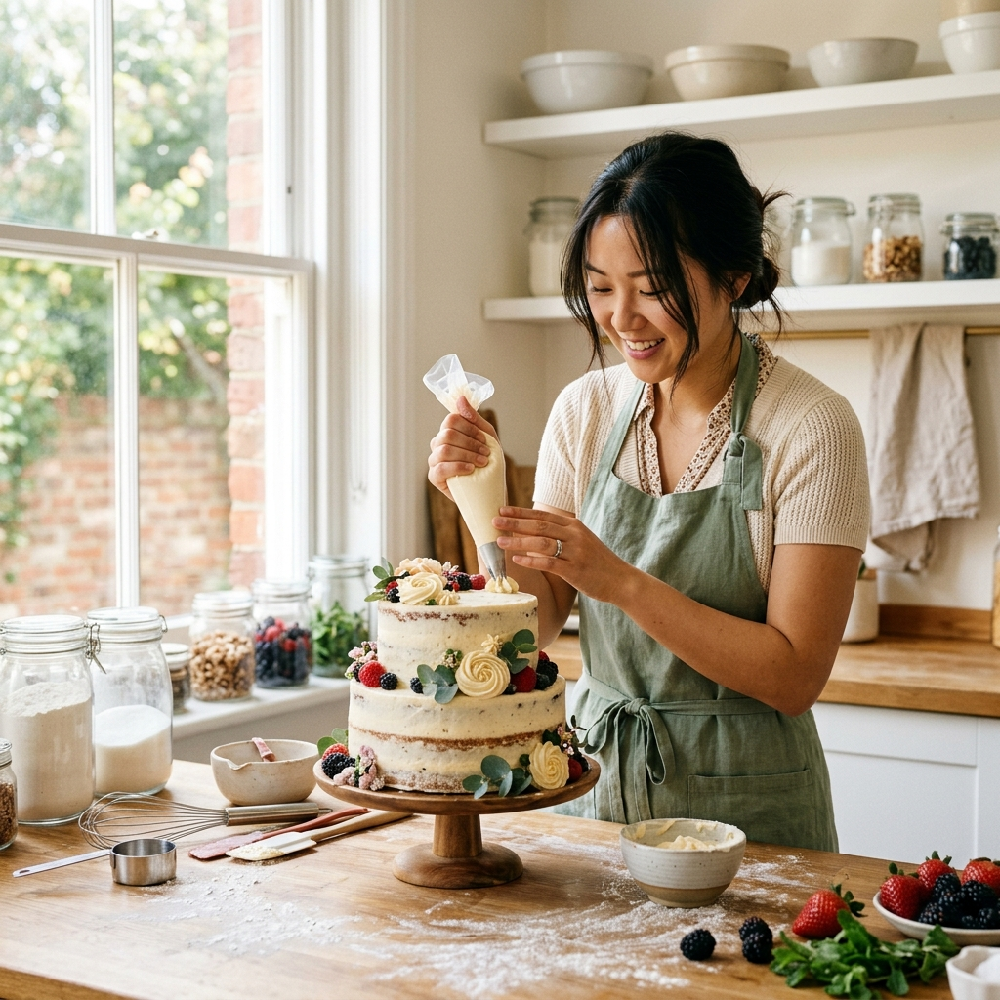
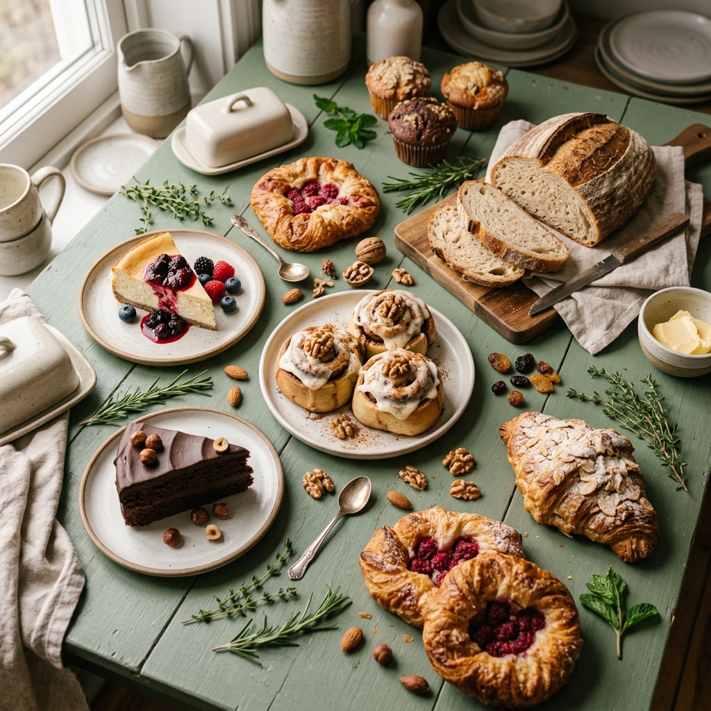

# Hệ thống hình ảnh — MOCO Kitchen

## 1. Vai trò của hình ảnh

Hình ảnh của MOCO không chỉ cần “đẹp và sáng”. Mỗi hình phải giúp người xem làm được ít nhất một trong ba việc:

1. **Muốn ăn:** nhìn rõ kết cấu, lớp kem, độ mềm và nguyên liệu đặc trưng.
2. **Hiểu sản phẩm:** nhận biết đúng kích thước, cách đóng gói, thành phần và cách dùng.
3. **Tin thương hiệu:** cảm nhận được đây là một căn bếp nhỏ làm bánh theo từng mẻ, không phải hình ảnh quảng cáo đại trà.

Vì vậy, ảnh sản phẩm thật là nền tảng. AI chỉ được dùng để thử bối cảnh, mở rộng phông nền hoặc tạo hình minh họa không làm thay đổi hình dáng món bánh.

## 2. Ý tưởng chủ đạo

### Bếp nhỏ, vị thật

MOCO được thể hiện như một căn bếp sáng vào buổi sớm: có ánh sáng cửa sổ, mặt bàn đã qua sử dụng, nguyên liệu đang được cân và món bánh vừa hoàn thiện. Hình ảnh không quá bóng bẩy; điểm hấp dẫn đến từ bề mặt thật của bánh, dấu vết làm thủ công và cảm giác có người đang chuẩn bị món ăn cho mình.

Ba từ khóa hình ảnh:

- **Thật:** đúng sản phẩm, đúng khẩu phần, đúng bao bì.
- **Ấm:** ánh sáng dịu, màu nguyên liệu tự nhiên, có cảm giác vừa ra khỏi bếp.
- **Rõ:** bố cục ít chi tiết thừa, người xem hiểu ngay món gì và điểm hấp dẫn nằm ở đâu.

Không theo hướng “spa healthy” quá trắng và lạnh. Không theo hướng bakery châu Âu sang trọng, nhiều hoa và đạo cụ. Không dùng hình ảnh khiến MOCO trông như một chuỗi cửa hàng lớn.

## 3. Ba nhóm hình ảnh

### 3.1 Buổi sáng nhẹ nhàng

Dùng cho Chuối Yến Mạch Choco, Bánh Mì Soda và Bánh Mì Cuộn Quế.

- Bối cảnh: cạnh cửa sổ, bàn gỗ sáng, khăn linen, cốc cà phê hoặc trà.
- Cảm xúc: dễ bắt đầu, gần gũi, có thể dùng như bữa sáng hoặc bữa phụ.
- Góc máy: 45 độ hoặc ngang tầm mặt bánh; ưu tiên ảnh cắt đôi để thấy kết cấu.
- Đạo cụ: tối đa hai món, chẳng hạn cốc gốm và dao bánh.

### 3.2 Khoảnh khắc tráng miệng

Dùng cho Keto Tiramisu, Keto Lemon Cheesecake và Carrot Cake.

- Bối cảnh: bàn ăn nhỏ, đĩa gốm, muỗng hoặc nĩa, ánh sáng chiều mềm.
- Cảm xúc: một phần thưởng vừa đủ, dùng chậm và có thể chia sẻ.
- Góc máy: cận lớp bánh, thao tác múc hoặc cắt, thêm một ảnh toàn phần để thấy kích thước.
- Đạo cụ: cà phê cho Tiramisu; chanh cho Cheesecake; cà rốt, quế hoặc óc chó cho Carrot Cake.

### 3.3 Từ căn bếp

Dùng cho Bông Lan Trứng Muối, nội dung hậu trường và câu chuyện founder.

- Bối cảnh: bàn cân nguyên liệu, khay bánh, tay đang hoàn thiện hoặc đóng hộp.
- Cảm xúc: chăm chút, có quy trình, làm theo mẻ nhỏ.
- Góc máy: cận bàn tay và thao tác; không cần luôn lộ mặt.
- Chi tiết nên giữ: vụn bánh, bột trên bàn, khăn bếp hoặc dụng cụ thật ở mức vừa phải.

## 4. Màu sắc và chất liệu

| Vai trò | Màu | Mã màu | Cách dùng |
|---|---|---|---|
| Màu thương hiệu | Xanh lá đậm | `#355C3B` | Logo, tiêu đề, mảng nền nhỏ |
| Xanh phụ | Xanh lá dịu | `#6F8F57` | Khăn, lá, đường viền hoặc điểm nhấn |
| Nền chính | Kem ấm | `#F8F4E9` | Nền ảnh, card, carousel |
| Nền sáng | Trắng kem | `#FFF8E7` | Khoảng thở và nền chữ |
| Điểm nhấn | Đất nung | `#C86F4E` | Giá, nút kêu gọi hoặc chi tiết nhỏ |
| Chữ | Xanh than | `#243127` | Nội dung chính |

Chất liệu ưu tiên: gốm men lì, gỗ sáng hoặc gỗ trung tính, linen kem, giấy nến và bao bì thật. Tránh marble bóng, phụ kiện mạ vàng, hoa trang trí dày và các bề mặt làm món bánh trông xa lạ với căn bếp MOCO.

## 5. Ánh sáng, góc máy và hậu kỳ

### Ánh sáng

- Nguồn sáng chính từ một phía, mô phỏng cửa sổ.
- Nhiệt độ màu trung tính ấm; phần kem vẫn phải giữ được màu trắng thật.
- Bóng đổ mềm nhưng còn đủ độ tương phản để thấy kết cấu.
- Không dùng ánh sáng vàng gắt, ngược sáng cháy nền hoặc hiệu ứng tối kiểu nhà hàng.

### Bộ góc chụp tối thiểu cho mỗi sản phẩm

1. **Ảnh nhận diện:** thấy trọn món bánh và cách trình bày.
2. **Ảnh kết cấu:** cắt, bẻ hoặc múc để thấy phần bên trong.
3. **Ảnh đúng kích thước:** đặt cạnh tay, muỗng, đĩa hoặc bao bì thật.
4. **Ảnh sử dụng:** bánh xuất hiện trong một tình huống ăn thực tế.

### Hậu kỳ

- Giữ màu bánh và bao bì gần với ảnh gốc.
- Không làm kem trắng quá mức, tăng độ bóng giả hoặc thêm nguyên liệu không có trong công thức.
- Chừa khoảng trống có chủ đích nếu ảnh cần đặt tiêu đề.
- Logo, giá và chữ luôn được thêm sau bằng công cụ thiết kế; không yêu cầu AI vẽ chữ.

## 6. Dấu hiệu hình ảnh riêng cho từng sản phẩm

| Sản phẩm | Chi tiết phải nhìn thấy | Bối cảnh phù hợp | Tránh |
|---|---|---|---|
| Chuối Yến Mạch Choco | Ruột mềm ẩm, chocolate chip, hạt bí | Bữa sáng cạnh cà phê | Biến thành ổ banana bread lớn nếu sản phẩm thật là phần 200g |
| Bánh Mì Soda Nguyên Cám | Vỏ nứt, lát cắt và ruột bánh | Thớt gỗ, dao bánh, bơ hoặc phô mai | Ổ sourdough có tai bánh hoặc lỗ khí quá lớn |
| Keto Lemon Cheesecake | Mặt kem, lớp đế và kích thước 10cm | Đĩa gốm, chanh vàng, nĩa nhỏ | Trang trí hoa hoặc hạt không có trên bánh thật |
| Carrot Cake Kem Hy Lạp | Cà rốt, óc chó, nho khô và lớp kem | Trà chiều, nền kem hoặc nâu nhạt | Bánh tầng cao kiểu tiệc cưới |
| Keto Tiramisu | Hộp vuông 350g, lớp kem và cocoa | Cà phê, muỗng, bàn tối giản | Hũ tròn hoặc ly nhà hàng không giống bao bì thật |
| Bông Lan Trứng Muối | Kem trứng, trứng muối và chà bông | Khay bánh, cảnh hoàn thiện topping | Bánh bông lan trơn hoặc topping hải sản phóng đại |
| Bánh Mì Cuộn Quế | Vân quế, phần ruột kéo mềm, lớp kem | Khay vừa ra lò, cốc cà phê | Sáu cuộn giống hệt nhau và quá hoàn hảo như ảnh stock |

## 7. Hệ thống bố cục cho Facebook và Instagram

### Ảnh đơn 4:5

- Sản phẩm chiếm khoảng 60–70% khung hình.
- Chừa một vùng thoáng ở trên hoặc bên trái để đặt tiêu đề ngắn.
- Chỉ có một điểm nhìn chính; không rải nguyên liệu quanh toàn bộ khung.

### Carousel

| Trang | Vai trò |
|---:|---|
| 1 | Hình hấp dẫn nhất và một câu mở đầu |
| 2 | Cận kết cấu hoặc nguyên liệu chính |
| 3 | Khối lượng, giá hoặc cách dùng |
| 4 | Chất gây dị ứng và lưu ý cần biết |
| 5 | Cách đặt hàng hoặc câu hỏi gợi tương tác |

### Reel

- Ba giây đầu phải có chuyển động thật: cắt bánh, múc kem, kéo ruột bánh hoặc mở hộp.
- Một video chỉ kể một việc, không cố giới thiệu cả menu.
- Xen ba cỡ cảnh: toàn sản phẩm, thao tác tay và cận kết cấu.
- Chữ trên video ngắn, dễ đọc trên điện thoại và không che món bánh.

## 8. Hình ảnh cho năm bài đăng mẫu

| Bài đăng | Bộ hình cần có | Điểm phải chứng minh |
|---|---|---|
| Chuối Yến Mạch Choco | Ảnh 4:5 bánh cắt đôi; cận ruột bánh; ảnh cạnh cà phê | Phần 200g, kết cấu mềm ẩm, phù hợp bữa phụ |
| Keto Tiramisu | Mở hộp; múc một thìa; hộp cạnh muỗng để thấy kích thước | Bao bì vuông 350g, lớp bánh thật, có thể chia 2–3 phần |
| Không dùng đường trắng | Flat lay nguyên liệu thật; bốn trang giải thích bằng chữ | Minh bạch thành phần, không biến bài thành ảnh “ăn kiêng” chung chung |
| Bánh Mì Cuộn Quế | Video cán bột, cuộn, khay nướng, phủ kem và bẻ đôi | Làm theo mẻ nhỏ, vân quế và độ mềm |
| Chọn bánh lần đầu | Ba sản phẩm chụp cùng ánh sáng và cùng tỷ lệ | So sánh được hương vị, khối lượng và mức giá |

## 9. Kiểm tra tài sản hình ảnh hiện có

### Minh họa cho quyết định sử dụng

| Ảnh sản phẩm thật có thể dùng | Hình bếp không đại diện cho MOCO | Hình tổng hợp sai danh mục |
|---|---|---|
|  |  |  |
| Đúng sản phẩm và bao bì; cần bổ sung góc múc, cắt và kích thước. | Nhân vật, bếp và bánh tầng không phải founder hay sản phẩm MOCO. | Nhiều món không nằm trong menu, làm sai hình dung về thương hiệu. |

### Có thể dùng

| Tệp | Đánh giá | Cách dùng |
|---|---|---|
| `moco-tiramisu-real.png` | Ảnh sản phẩm thật, thấy rõ hộp và bề mặt | Menu, bài Tiramisu; cần bổ sung ảnh múc và ảnh kích thước |
| `moco-lemon-packaged.png` | Bám sát sản phẩm và cách đóng gói | Menu, thông tin đặt hàng |
| `moco-lemon-hero.png` | Hình sản phẩm rõ, phù hợp ảnh đầu trang | Dùng khi cách trang trí đúng mẻ bánh đang bán |
| `moco-logo-green.png` | Tài sản nhận diện chính thức | Chỉ đặt trong khâu thiết kế |
| `floating-leaf.png`, `floating-almonds.png`, `floating-cinnamon.png` | Chi tiết trang trí | Dùng tiết chế, không thay thế ảnh nguyên liệu thật |

### Chỉ dùng làm hình minh họa hoặc tạm thời

| Tệp | Vấn đề | Hướng xử lý |
|---|---|---|
| `product-*.png` | Phong cách ảnh đẹp nhưng chưa chứng minh đúng hình dáng và khẩu phần thật | Thay dần bằng ảnh chụp thật theo bộ bốn góc |
| `hero-cheesecake.png` | Hình ảnh lý tưởng hóa, có thể khác trang trí thực tế | Chỉ dùng trang trí nếu đã đối chiếu với sản phẩm |

### Không dùng để chứng minh sản phẩm hoặc câu chuyện thương hiệu

| Tệp | Lý do |
|---|---|
| `story-behind.png` | Nhân vật, không gian và bánh tầng không phải founder hay căn bếp MOCO |
| `og-cover.jpg` | Có nhiều loại bánh không nằm trong menu; tạo cảm giác một bakery khác |

Hai hình trên cần được thay bằng ảnh bếp thật, bàn tay founder hoặc một ảnh tổng hợp đúng bảy sản phẩm MOCO.

## 10. Danh sách hình cần sản xuất tiếp

### Ưu tiên 1 — Bắt buộc trước khi nộp

1. Ảnh tập thể đúng bảy sản phẩm để thay `og-cover.jpg`.
2. Ảnh founder hoặc tay đang làm bánh trong bếp thật để thay `story-behind.png`.
3. Bộ bốn góc cho Chuối Yến Mạch Choco, Tiramisu và Cuộn Quế, vì đây là các sản phẩm đã có bài đăng hoàn chỉnh.
4. Ảnh so sánh ba món Chuối, Cheesecake và Tiramisu cùng ánh sáng, cùng tỷ lệ.

### Ưu tiên 2 — Hoàn thiện thư viện

5. Bộ bốn góc cho bốn sản phẩm còn lại.
6. Một bộ flat lay nguyên liệu thật cho bài giải thích chất tạo ngọt.
7. Ba video dọc 15–25 giây: Cuộn Quế, Tiramisu và đóng gói đơn hàng.
8. Ảnh bao bì, tem nhãn và cách bánh được giao tới khách.

## 11. Quy trình sản xuất và kiểm tra

1. Chọn mục tiêu của ảnh và kênh sử dụng.
2. Đặt sản phẩm thật vào bối cảnh; chụp đủ bốn góc tối thiểu.
3. Chọn ảnh đúng sản phẩm trước, ảnh đẹp sau.
4. Nếu dùng AI, chỉ chỉnh nền hoặc ánh sáng từ ảnh thật; không tạo lại món bánh.
5. Đối chiếu hình với khối lượng, thành phần, bao bì và menu hiện hành.
6. Xuất các tỷ lệ cần dùng: 4:5 cho Feed, 9:16 cho Story/Reel, 1:1 cho thumbnail.
7. Founder duyệt ảnh cuối trước khi đăng hoặc đưa vào trang giới thiệu.

## Tài liệu liên quan

- [Bộ bài đăng Facebook và Instagram](../3_Content_Engine/moco_sample_posts_gem.md)
- [Lịch nội dung hai tuần](../3_Content_Engine/moco_content_calendar_sample.md)
- [Danh mục tài sản hình ảnh](../_Assets/asset_manifest.md)
- [Kịch bản phân cảnh video](video_storyboard_demo.md)
