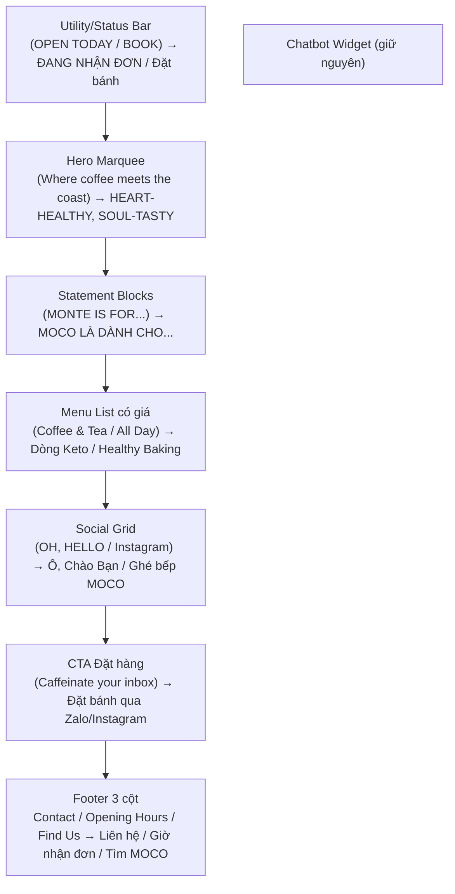

# Design — MOCO Kitchen Landing Page (Monte Cafe Layout Redesign)

## Tổng quan

Tài liệu này mô tả thiết kế kỹ thuật để tái cấu trúc landing page MOCO Kitchen theo **bố cục + ngôn ngữ thiết kế của Monte Cafe** (montecafe.com.au), trong khi giữ **bản sắc MOCO**: bảng màu Matcha Green và logo `moco-logo-green.png`.

Nhận diện thương hiệu tổng thể của MOCO Kitchen được mô tả trong [Design — Nhận diện thương hiệu](../../3_Creative_Content/design.md). File hiện tại chỉ tập trung vào cách áp dụng nhận diện đó vào landing page.

Thiết kế dựa trên 2 nguồn tham khảo:
1. **Layout/cấu trúc:** trình tự section của montecafe.com.au (utility status bar → hero marquee → statement blocks → menu list → social grid → CTA → footer 3 cột).
2. **Design system (refero.design — "Monte / Warm Terracotta Cafe"):** palette giới hạn, tương phản typography mạnh, **bề mặt phẳng + viền mảnh thay vì shadow nặng**, bo góc 14px (card) / 9999px (input/pill), nút primary dạng **outline**, spacing thoáng (section gap ~48px+), density "comfortable".

**Nguyên tắc chuyển hoá thương hiệu:** ánh xạ vai trò màu của Monte sang MOCO.

| Vai trò (Monte) | Monte | MOCO (giữ nguyên palette hiện có) |
|---|---|---|
| Brand chủ đạo | Terracotta `#b84b30` | Matcha Green `#355C3B` (`--color-primary`) |
| Accent | Espresso `#5f1d1a` | `--color-primary-dark` `#223F29` / accent `#C86F4E` |
| Nền canvas | Cream `#f8f4e9` | `--color-bg` `#F8F4E9` (trùng nhau ✅) |
| Surface sáng | White | `--color-surface` `#FFFFFF` |
| Border mảnh | Silver `#e5e7eb` | `--color-border` `rgba(74,103,65,0.12)` |

> Vì nền cream của hai bên gần như trùng, việc port layout giữ được cảm giác "warm, handcrafted" mà không cần đổi màu MOCO.

### Bài học từ bản hiện tại (rút kinh nghiệm)
- Hero cũ dùng kỹ thuật "typography lớp chồng + ảnh nổi tuyệt đối" (`position: absolute` nhiều lớp) → khó canh trên nhiều màn hình, dễ vỡ ở tablet. **Bản mới dùng marquee + flow layout đơn giản, ít absolute hơn.**
- Bản cũ phụ thuộc nhiều `position: absolute` cho badge/side-info → mobile phải override nhiều. **Bản mới ưu tiên flexbox/grid theo luồng.**
- Bản cũ là shop bán bánh nhưng **không hiển thị giá** và **không có khối đặt hàng mạnh**. Bản mới: **menu có giá rõ ràng** + CTA đặt qua Zalo/Instagram nổi bật.
- Giữ lại những phần đã chạy tốt: chatbot widget, FAQ accordion, IntersectionObserver scroll-reveal, mobile nav toggle.

---

## Kiến trúc & Cấu trúc trang

### Sơ đồ section (so sánh Monte ↔ MOCO)



### Cấu trúc DOM mục tiêu của `index.html`

```text
<body>
  ├── .topbar              (R1 — utility/status bar)
  ├── nav.navbar           (logo MOCO + menu + CTA; giữ mobile toggle)
  ├── header.hero          (R2 — marquee tagline + keep-scrolling + ảnh sản phẩm)
  ├── section.statements   (R3 — 2–4 khối statement reveal)
  ├── section.menu         (R4 — menu list theo nhóm, CÓ GIÁ)
  ├── section.gallery      (R5 — social grid "Ô, Chào Bạn")
  ├── section.order        (R6 — CTA Zalo/Instagram)
  ├── footer.footer        (R7 — 3 cột: Liên hệ / Giờ nhận đơn / Tìm MOCO)
  ├── .chatbot-widget      (R9 — giữ nguyên, dùng chatbot.js)
  └── <script src="/app.js">
</body>
```

---

## Thiết kế chi tiết từng thành phần

### 1. Topbar / Utility Status Bar (R1)
- Thanh mảnh ~36–40px phía trên navbar, nền `--color-primary-dark`, chữ cream, uppercase, letter-spacing rộng (gợi phong cách Monte "OPEN TODAY TIL 1:30PM NEWCASTLE 20°C").
- Nội dung trái: `● ĐANG NHẬN ĐƠN — HÀ NỘI` (chấm trạng thái).
- Nội dung phải: link `ĐẶT BÁNH ↗` (anchor `#order`).
- Mobile (≤768px): ẩn phần khu vực, giữ trạng thái + CTA; thu gọn font.
- `prefers-reduced-motion`: chấm trạng thái không nhấp nháy.

### 2. Navbar (cập nhật, giữ hành vi)
- Logo `/assets/moco-logo-green.png` bên trái; links: Sản Phẩm / Câu Chuyện / Bộ Sưu Tập / Hỏi Đáp / **Đặt Hàng** (CTA pill outline 9999px).
- Sticky, đổi nền nhẹ khi scroll (giữ class `scrolled`).
- Mobile: hamburger toggle (giữ `#navToggle` / `#navLinks`).
- Nút CTA: **outline style** (viền `--color-primary`, nền trong suốt) theo guideline Monte — không nền đặc, không shadow nặng.

### 3. Hero Marquee (R2)
- Bố cục dọc theo luồng (không chồng absolute nhiều như bản cũ):
  - **Marquee row**: dải chữ display lớn chạy ngang lặp lại: `HEART-HEALTHY, SOUL-TASTY • BÁNH HEALTHY THỦ CÔNG •` (lặp). Kỹ thuật: 2 bản copy nội dung đặt cạnh nhau trong track, dịch `translateX(-50%)` bằng `@keyframes marquee` để lặp seamless.
  - **Hero body**: tiêu đề `h1` (tagline chính), một đoạn mô tả ngắn, CTA outline "Khám phá menu" + "Đặt bánh".
  - **Hero visual**: ảnh sản phẩm thật (`moco-lemon-hero.png` hoặc `moco-tiramisu-real.png`) bo góc 14px, viền mảnh, không shadow nặng.
  - **Keep-scrolling**: dòng nhỏ + mũi tên dưới cùng "Cuộn xuống để khám phá nhé ↓".
- `prefers-reduced-motion: reduce` → `animation: none` cho marquee (chữ đứng yên, vẫn đọc được).
- Mobile: marquee giảm font, hero body + visual xếp dọc 1 cột; `overflow-x: hidden` ở mức section để chỉ marquee được tràn có kiểm soát.

### 4. Statement Blocks (R3)
- 2–4 khối chữ lớn, căn trái và xen kẽ, mỗi khối là một thông điệp của MOCO. Nội dung lấy từ phần câu chuyện và các lưu ý hiện có, ví dụ:
  - "MOCO là dành cho những buổi sáng nhẹ nhàng, những lời hẹn cà phê, và món ngọt không cần thấy có lỗi."
  - "Không đường tinh luyện. Không phẩm màu. Không chất bảo quản. Chỉ có nguyên liệu thật và sự tỉ mỉ."
  - "Mỗi mẻ bánh nướng tươi mỗi ngày tại Hà Nội — số lượng giới hạn."
- Khối chính có CTA phụ ("Khám phá menu ↗").
- Reveal khi vào viewport bằng `.animate-on-scroll` + IntersectionObserver (giữ cơ chế cũ trong `app.js`).
- Tách section bằng khoảng trắng rộng + divider mảnh `--color-border` (không shadow).

### 5. Menu List CÓ GIÁ (R4) — khác Monte vì bán bánh
- Trình bày dạng **danh sách/cột** gợi nhớ menu Monte (Coffee & Tea / All Day Menu), nhóm theo 2 danh mục.
- Mỗi danh mục là một khối có tiêu đề + (tuỳ chọn) accordion mở/đóng.
- **Hàng món (menu row)** bố cục: `[thumbnail] · Tên món · ……dotted leader…… · Giá` + dòng mô tả nhỏ + tag đặc trưng + cảnh báo (nếu có rượu).
- Dotted leader (đường chấm nối tên → giá) là chi tiết kiểu thực đơn cổ điển, hợp tinh thần Monte.
- Dữ liệu giá đã xác nhận:

  **Dòng Keto (Keto dessert)**
  | Món | Size | Giá |
  |---|---|---|
  | Keto Tiramisu ⚠️(có rượu) | 350g | 180.000đ |
  | Keto Lemon Cheese Cake | 250g, size 10cm | 140.000đ |

  **Dòng Healthy Baking**
  | Món | Size | Nhóm | Giá |
  |---|---|---|---|
  | Carrot Cake Kem Hy Lạp | 220g | Healthy cake | 90.000đ |
  | Bông Lan Trứng Muối Yến Mạch | 230g | Healthy cake | 75.000đ |
  | Bánh Mì Soda Nguyên Cám | 450g | Healthy bread | 70.000đ |
  | Chuối Yến Mạch Choco | 200g | Healthy cake | 40.000đ |
  | Bánh Cuộn Quế Nguyên Cám | 100g | Healthy pastry | 40.000đ |

- Giữ lưu ý về dị ứng và nguy cơ nhiễm chéo dưới menu.
- Mobile: mỗi hàng món xếp dọc (thumbnail trên, tên + giá hàng, mô tả dưới); ẩn dotted leader.

### 6. Social Gallery "Ô, Chào Bạn" (R5)
- Tiêu đề lớn kiểu thân thiện: "Ô, Chào Bạn 👋" + sub "Ghé bếp MOCO" (tương ứng "OH, HELLO").
- Grid ảnh sản phẩm thật từ `/assets`: `product-*.png`, `moco-*.png`, `story-behind.png` (6–8 ô). Desktop 3–4 cột, tablet 2–3, mobile 2.
- Hover (desktop): zoom nhẹ + overlay caption tên món; dùng `@media (hover:hover)` để mobile không kẹt hover state.
- Link "Theo dõi trên Facebook/Instagram ↗" → kênh MOCO.

### 7. CTA Đặt Hàng (R6) — thay Newsletter
- Section nền `--color-primary` (matcha đậm), chữ cream — điểm nhấn tương phản như khối CTA của Monte.
- Tiêu đề "Đặt bánh MOCO ngay hôm nay 🤎" + mô tả: làm thủ công số lượng nhỏ, nhắn sớm, giao khu vực **Hà Nội**.
- Nút: **Zalo**, **Instagram** (+ Facebook), dạng pill, mở tab mới `rel="noopener"`.
- Không có biểu mẫu email và không gửi dữ liệu đến dịch vụ bên thứ ba.

### 8. Footer 3 cột (R7)
- Grid 3 cột (mobile 1 cột): **Liên Hệ** (Zalo 0904 826 585, Instagram @moco_kitchen242, Facebook MoCo Kitchen) · **Giờ Nhận Đơn** (9:00–17:00 từ Thứ Hai đến Thứ Bảy, nghỉ Chủ Nhật) · **Tìm MOCO** (368B Quang Trung, Hà Đông, Hà Nội + link Google Maps).
- Hàng trên: logo MOCO + tagline "Heart-Healthy, Soul-Tasty".
- Hàng dưới: lưu ý dinh dưỡng và dòng bản quyền “© 2026 MOCO Kitchen. Dự án cuối khóa Google AI Bootcamp”.

### 9. Chatbot Widget (R9)
- Giữ nguyên markup `.chatbot-widget` + nạp `chatbot.js`; không đụng `api/`.
- Chỉ kiểm tra lại biến màu CSS chatbot vẫn khớp palette.

---

## Hệ thống thiết kế (Design Tokens áp dụng)

Giữ nguyên `:root` hiện có, **bổ sung** vài token theo phong cách Monte:

```css
:root {
  /* ... giữ nguyên các biến màu MOCO hiện có ... */

  /* Spacing kiểu Monte (comfortable) */
  --space-section: clamp(56px, 8vw, 96px);  /* gap dọc giữa section */
  --space-card: 24px;                        /* padding card */

  /* Shape */
  --radius-card: 14px;     /* card theo Monte */
  --radius-pill: 9999px;   /* nút/pill theo Monte */

  /* Typography display lớn */
  --fs-display: clamp(2.2rem, 6vw, 4.5rem);
  --fs-statement: clamp(1.6rem, 4vw, 3rem);
}
```

- **Typography:** giữ Playfair Display (display, thay vai trò Riposte), Quicksand (body), Pacifico (brand accent). Tăng letter-spacing cho nhãn uppercase để gần "feel" Monte.
- **Bề mặt:** ưu tiên **viền mảnh + nền phẳng**; giảm `box-shadow` nặng (đúng guideline "DON'T use heavy box-shadows"). Chỉ dùng shadow rất nhẹ cho ảnh hero/menu thumbnail.
- **Nút primary:** outline (viền matcha, nền trong suốt, hover fill nhẹ).

---

## Thiết kế JavaScript (`app.js`)

Giữ các module cũ còn dùng, thêm/sửa:

| Hành vi | Trạng thái | Ghi chú |
|---|---|---|
| Navbar scroll `scrolled` | Giữ | Như cũ |
| Mobile nav toggle | Giữ | Như cũ |
| Smooth scroll anchor | Giữ | Như cũ |
| IntersectionObserver reveal `.animate-on-scroll` | Giữ | Dùng cho statements/menu/gallery |
| FAQ accordion | Giữ nếu vẫn còn FAQ (xem mục dưới) | — |
| Testimonial carousel | **Bỏ/tuỳ chọn** | Monte không có; cân nhắc lược bớt cho gọn |
| Parallax floating leaves | **Bỏ** | Không hợp layout marquee mới |
| **Marquee** | **Mới** | CSS-driven; JS chỉ cần pause khi `prefers-reduced-motion` (đã xử lý bằng CSS, JS optional) |
| **Menu accordion** (nếu dùng) | **Mới** | Toggle nhóm Keto/Healthy |
| **Gallery hover caption** | **Mới (CSS chính)** | JS không bắt buộc |

> Lưu ý refactor: gỡ code parallax/stats-counter không còn dùng để tránh lỗi `null` khi phần tử không còn tồn tại (bản cũ query `.floating-el`, `.stat-number`).

### Quyết định về FAQ & Testimonials
- **FAQ:** giữ lại (hữu ích cho bán bánh: bảo quản, dị ứng, giao hàng) — đặt **trước footer** hoặc gộp gần menu. Monte không có FAQ nhưng đây là landing bán hàng nên cần. Giữ accordion hiện có.
- **Testimonials:** Monte không có dạng carousel; có thể **lược** hoặc rút thành 1 khối quote tĩnh để trang gọn theo tinh thần Monte. Đề xuất: giữ tối giản (tĩnh) hoặc bỏ. Sẽ chốt ở phần tasks.

---

## Responsive Strategy

| Breakpoint | Hành vi chính |
|---|---|
| ≥1024px (desktop) | Topbar đầy đủ; hero marquee + body 2 vùng; menu list rộng có dotted leader; gallery 3–4 cột; footer 3 cột |
| 768px (tablet) | Gallery 2–3 cột; statement font giảm; menu giữ list |
| ≤480px (mobile) | Nav hamburger; topbar rút gọn; hero 1 cột; menu row xếp dọc, ẩn dotted leader; gallery 2 cột; footer 1 cột |

- Toàn trang: `overflow-x: hidden` ở body để marquee không tạo scroll ngang ngoài ý muốn.
- Ảnh dưới fold: `loading="lazy"` + `width/height` để hạn chế CLS.

---

## Khả năng truy cập (Accessibility)
- 1 `h1` duy nhất ở hero; `h2` cho mỗi section; `h3` cho tên món.
- `alt` mô tả cho mọi ảnh sản phẩm; ảnh trang trí `alt=""`.
- Nút/anchor đủ tương phản trên nền matcha (cream trên xanh đậm đạt AA).
- Marquee bọc `aria-hidden="true"` nếu chỉ trang trí, và có tiêu đề thật cho screen reader; tôn trọng `prefers-reduced-motion`.
- Accordion menu: dùng `<details>/<summary>` hoặc button có `aria-expanded`.

---

## Mapping Requirements → Design

| Requirement | Thành phần thiết kế |
|---|---|
| R1 Utility bar | §1 Topbar |
| R2 Hero marquee | §3 Hero Marquee + JS marquee |
| R3 Statement blocks | §4 Statements + reveal |
| R4 Menu có giá | §5 Menu List + bảng giá |
| R5 Social grid | §6 Gallery "Ô, Chào Bạn" |
| R6 CTA đặt hàng | §7 CTA Zalo/Instagram |
| R7 Footer 3 cột | §8 Footer |
| R8 Giữ brand | Token mapping + logo + nội dung MOCO |
| R9 Chatbot | §9 giữ nguyên |
| R10 Responsive/A11y/Perf | Responsive Strategy + Accessibility |

---

## Rủi ro & Giảm thiểu
- **Marquee gây scroll ngang** → bọc trong wrapper `overflow:hidden`, test kỹ mobile.
- **Refactor làm hỏng chatbot** → không động `chatbot.js`/`api/`; chỉ đổi markup landing.
- **Gỡ JS cũ (parallax/stats) gây lỗi tham chiếu** → rà soát `app.js`, guard `if (el)` hoặc xoá hẳn block không dùng.
- **Cache CSS** → bản hiện tại dùng query version (`style.css?v=...`); cập nhật version khi đổi CSS để tránh cache cũ.
- **Giá hiển thị sai** → dùng đúng bảng giá đã xác nhận trong tài liệu này.
