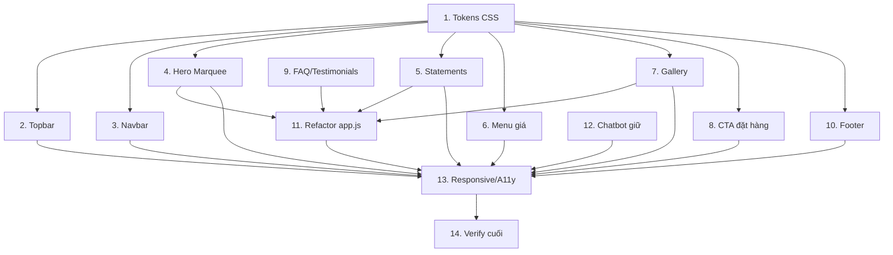

# Tasks — MOCO Kitchen Landing Page (Monte Cafe Layout Redesign)

Triển khai redesign theo `requirements.md` + `design.md`. Stack: HTML/CSS/JS tĩnh. Giữ chatbot + palette + logo MOCO.

> **Trạng thái:** ✅ Hoàn thành — baseline Monte v3 (xem `HANDOFF_LANDING_2026-05-29.md`). Toàn bộ 14 task đã triển khai và đang live trên Vercel.

- [x] 1. Chuẩn bị design tokens & nền CSS
  - Bổ sung biến `--space-section`, `--space-card`, `--radius-card`, `--radius-pill`, `--fs-display`, `--fs-statement` vào `:root` của `style.css`.
  - Thêm `overflow-x: hidden` cho body; chuẩn hoá nút outline primary theo phong cách Monte.
  - _Requirements: R8, R10_

- [x] 2. Topbar / Utility Status Bar
  - Thêm `.topbar` (trạng thái "ĐANG NHẬN ĐƠN — HÀ NỘI" + CTA "ĐẶT BÁNH ↗") trên navbar trong `index.html`.
  - CSS nền `--color-primary-dark`, chữ cream, uppercase; responsive rút gọn ở mobile.
  - _Requirements: R1_

- [x] 3. Cập nhật Navbar
  - Cập nhật links (Sản Phẩm / Câu Chuyện / Bộ Sưu Tập / Hỏi Đáp / Đặt Hàng), CTA pill outline.
  - Giữ logo MOCO + mobile hamburger toggle.
  - _Requirements: R8, R10_

- [x] 4. Hero Marquee
  - Thay hero cũ bằng: marquee track chữ display lặp seamless + hero body (h1 tagline, mô tả, CTA outline) + ảnh sản phẩm thật + dòng "Cuộn xuống ↓".
  - CSS `@keyframes marquee`; tôn trọng `prefers-reduced-motion`.
  - _Requirements: R2, R8, R10_

- [x] 5. Statement Blocks
  - Thêm `section.statements` với 3 khối câu giá trị MOCO (lấy từ story/disclaimer), khối chính có CTA phụ.
  - Dùng `.animate-on-scroll` cho reveal.
  - _Requirements: R3_

- [x] 6. Menu List CÓ GIÁ
  - Dựng `section.menu` dạng list theo 2 nhóm (Keto / Healthy Baking) với thumbnail + tên + dotted leader + giá + mô tả + tag + cảnh báo rượu.
  - Điền đúng bảng giá founder duyệt; giữ disclaimer dị ứng.
  - Mobile: xếp dọc, ẩn dotted leader.
  - _Requirements: R4, R8_

- [x] 7. Social Gallery "Ô, Chào Bạn"
  - Dựng `section.gallery` grid ảnh sản phẩm thật + hover caption (CSS, `@media hover:hover`) + link theo dõi social.
  - Responsive cột (4/3/2).
  - _Requirements: R5_

- [x] 8. CTA Đặt Hàng (Zalo/Instagram)
  - Thay khối newsletter bằng `section.order` nền matcha: tiêu đề + mô tả (thủ công, đặt sớm, giao Hà Nội) + nút Zalo/Instagram/Facebook `rel="noopener"`.
  - Không form email, không endpoint lạ.
  - _Requirements: R6_

- [x] 9. FAQ (giữ) + xử lý Testimonials
  - Giữ FAQ accordion (bảo quản/dị ứng/giao hàng) đặt trước footer.
  - Lược testimonials carousel thành khối tối giản hoặc bỏ; cập nhật markup tương ứng.
  - _Requirements: R10_

- [x] 10. Footer 3 cột
  - Dựng footer 3 cột: Liên Hệ (Zalo/Instagram/Facebook) · Giờ Nhận Đơn · Tìm MOCO (Hà Nội + map placeholder); logo + tagline + disclaimer + copyright.
  - _Requirements: R7, R8_

- [x] 11. Refactor `app.js`
  - Gỡ code parallax floating + stats-counter không còn dùng (tránh lỗi tham chiếu null).
  - Giữ navbar scroll, mobile toggle, smooth scroll, IntersectionObserver, FAQ.
  - Thêm guard cho carousel nếu giữ; đảm bảo không lỗi console khi phần tử bị bỏ.
  - _Requirements: R2, R9, R10_

- [x] 12. Giữ Chatbot Widget
  - Đảm bảo `.chatbot-widget` + `chatbot.js` còn nguyên, mở/đóng đúng, không đụng `api/`.
  - _Requirements: R9_

- [x] 13. Responsive & Accessibility pass
  - Kiểm tra 3 breakpoint (≥1024 / 768 / ≤480): không scroll ngang, marquee gọn, menu/gallery/footer co đúng.
  - Heading hierarchy (1 h1), `alt` ảnh, `loading="lazy"`, `prefers-reduced-motion`.
  - _Requirements: R10, R8_

- [x] 14. Verify cuối
  - Mở trang tĩnh kiểm tra không lỗi console nghiêm trọng; cập nhật version query `style.css?v=...`.
  - Đối chiếu trình tự section với Monte + checklist requirements.
  - _Requirements: R1–R10_

## Task Dependency Graph

